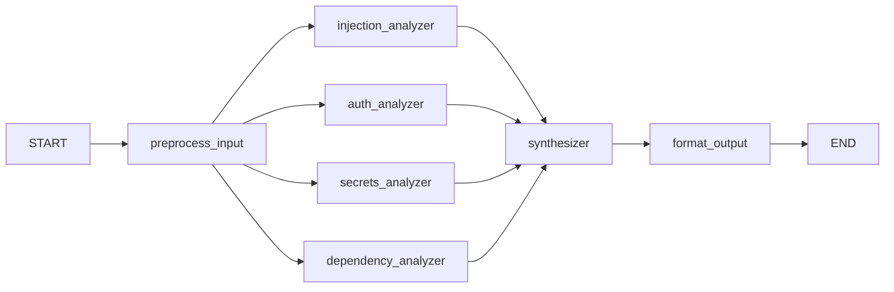

`# Week 3 — Multi-Node LangGraph Analysis Agent (v0.3)

Replaces the Week-1 monolith (`scan → analyze → score`, two broad LLM prompts)
with a graph of small, focused, structured nodes. Each analyzer is a separate
LLM call with its own narrow prompt and a constrained JSON output.

## Why a graph beats one big prompt
- **Testable** — you can unit-test "does the injection node find SQLi?" in isolation.
- **Explainable** — every finding is traceable to the node/rule that produced it.
- **Harder to hijack** — a small prompt that does one job and must return a fixed
  schema gives a prompt-injection attacker far less room than "analyze for everything."

## Graph (parallel fan-out → fan-in)

```
                       ┌─→ injection_analyzer ─┐   (A03, A04, A05)
                       ├─→ auth_analyzer ──────┤   (A01, A07)
 preprocess_input ─────┼─→ secrets_analyzer ───┼─→ synthesizer → format_output
   (no LLM)            └─→ dependency_analyzer ┘   (A06)
                                                    (A02)
```



## Node responsibilities

| Node | LLM? | Job | OWASP rules |
|------|------|-----|-------------|
| `preprocess_input` | No | strip/flag injection-bearing comments, normalize whitespace, extract imports, run deterministic rule scan | — |
| `injection_analyzer` | Yes | SQLi, command injection, unsafe deserialization, misconfig | A03, A04, A05 |
| `auth_analyzer` | Yes | broken access control, weak authentication | A01, A07 |
| `secrets_analyzer` | Yes | hardcoded secrets, weak crypto | A02 |
| `dependency_analyzer` | Yes | vulnerable/outdated imports | A06 |
| `synthesizer` | Yes | dedupe + merge findings, summarize (operates on **findings, not raw code**) | — |
| `format_output` | No | enrich with rule metadata, apply confidence threshold, score | — |

## Structured output
Every analyzer returns a validated `FindingsList` (Pydantic) via Azure OpenAI
JSON mode (`llm.with_structured_output`). Each finding:
`{rule_id, line_hint, description, confidence}`. Malformed output is **rejected
(fail-closed → empty findings), not passed forward**.

## Defenses (built Fri)
1. Comment stripping/flagging in `preprocess_input` (kills comment-borne LLM01).
2. Schema enforcement on every node output.
3. Confidence threshold — findings below `CONFIDENCE_THRESHOLD` are marked
   `needs_review`, not asserted as confirmed vulnerabilities.

See `INJECTION_TEST_LOG.md` for the attack/defense research.
